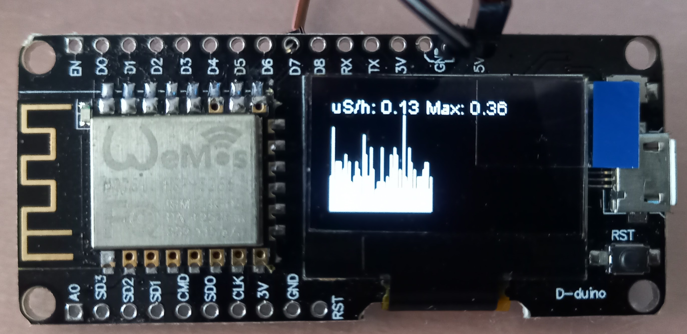
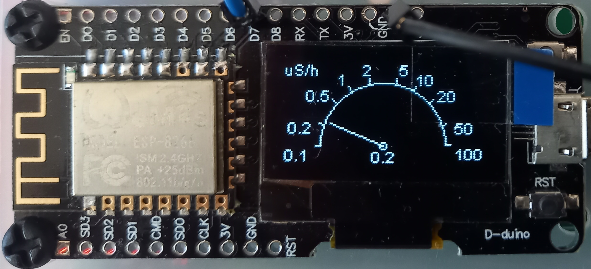

# Geiger Display
ESP8266 software to enhance a Geiger Counter kit with a OLED display.

Ready for use in PlatformIO (PIO) [https://platformio.org/](https://platformio.org/).

Functionality:
 - Simple pin input, interrupt driven
 - CPM (Counts per Minute) or µS/h (Micro Sieverts per hour)
 - Display a graph of previous counts
 - Log gauge CPM or µS/h and average / max
 - Average- or maximum CPM or µS/h
 - 4 update speeds: Very fast (5 sec), Fast (15 sec),  Normal (30 sec), Slow (1 min), Very Slow (2 min)

