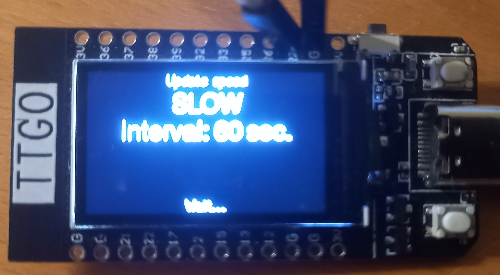

# Geiger Display
Software to enhance a Geiger Counter kit with a display.

Currently adapted for a TTGO-Display.

Ready for use in PlatformIO (PIO) [https://platformio.org/](https://platformio.org/).

Functionality:
 - Simple pin input, interrupt driven
 - CPM (Counts per Minute) or µS/h (Micro Sieverts per hour)
 - Display a graph of previous counts
 - Log gauge CPM or µS/h and average / max
 - Average- or maximum CPM or µS/h
 - 4 update speeds: Very fast (5 sec), Fast (15 sec),  Normal (30 sec), Slow (1 min), Very Slow (2 min)

## Geiger counter kit

## Example images of display
The images are over exposed because of the LCD. However, to give an impression:

### Startup screen
As this is no commercial or calibrated product, Krusty is there to remember you each time you start!

### Time graph including AVG or MAX

### Logarithmic scale of the actual level
 There are other, identical looking, screens (avg and max)

### Logarithmic scale of the Counts Per Minute (CPM)
Also here, there are other, identical looking, screens (avg and max)

### Total exposure
Since startup.

# Example image of setting the update speed to slow

